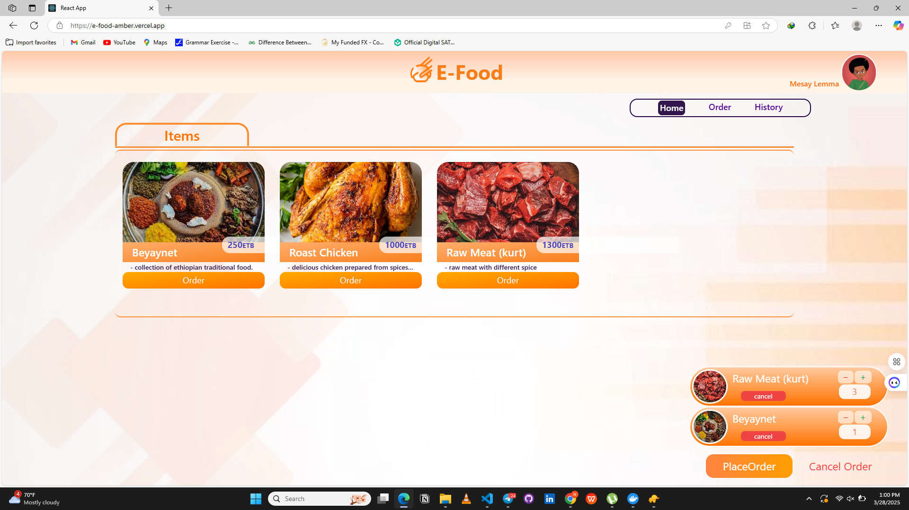

# <a href="https://e-food-amber.vercel.app" target="_blank" > E Food App Link</a>

## Food Ordering App

- user-friendly application that have those features.

### For Client

- order, notification, and order history features
- client can see his/her food status( Food status: Accepted, Preparing, Ready, Delivered)

### For Hotel Manager

- Accept order and track food status
- Have add food feature and also notification feature
- Report Analysis of Food Sold in a day, week and month

## Step by Step guidance

This Example supports two types of users:

- **Client:** Mesay Lemma (places food orders)
- **Admin:** Naomi Zerfu (manages orders and updates status)

Below is a visual walkthrough of how the application works from login to order completion.

### Step 1: Login as User

Mesay Lemma logs in to access the food ordering system.

### Step 2: View Listed Foods and Add to Cart

Mesay browses the available food items and adds desired dishes to the cart.

### Step 3: View Added Cart

The user reviews the selected items in their cart.

### Step 4: Place Order

After reviewing, the user places the food order.

### Step 5: Order Placed

user confirming that the order has been placed successfully.

### Step 6: Go to Admin Page

Admin Naomi Zerfu logs in to the admin dashboard to manage incoming orders.

### Step 7: Admin Receives Order Notification

The admin gets notified about the new order.

### Step 8: Update Order Status

The admin updates the order status from `Pending` to `Accepted`, and then continues updating as the food gets prepared.

### Step 9: Return to User Page

The user goes back to their dashboard to track the order.

### Step 10: User Receives Real-Time Status Updates

Mesay Lemma receives notifications as the admin updates the order status.

### Step 11: Status Example – Pending → Accepted

In this example, the food status changes from `Pending` to `Accepted`.

### For User sign up as Hotel Manager use below account

**ADMIN phonenumber = 0991065050, password= naomi**

### The Database might have expired by this time if you tried the link
